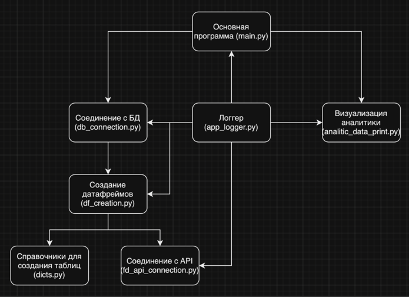

# Исследование данных службы поддержки

## Проблема
В отделе клиентской поддержки используется система для фиксации обращений клиентов. Требуется начать работать с данными автоматизированно, чтобы проверять гипотезы и строить аналитику по обращениям. На текущий момент используется “ручное” скачивание  CSV файла в Google Sheets и построение сводных таблиц и графиков, что занимает много времени.

## Задачи
* Получить данные об обращениях по API и сохранить в базу данных.
* Проверить гипотезу 
  * С марта 2023 года наблюдался рост среднего времени решения задач с любым приоритетом. В августе-сентябре 2023 года были приняты процессные изменения в работе, что должно было сократить время решения задач.
* Посчитать средние пропорции распределения задач между 1 линией, 2 линией и задачами, переданными в разработку с марта до декабря 2023 года.
* Определить отдельно на 1 и 2 линии поддержки топ-5 категорий задач, которые решались дольше всего с марта по декабрь 2023 года. Чтобы в дальнейшем начать оптимизацию с этих задач.
* Визуализировать полученные результаты.

## Информация

### Используемые технологии
* SQLite - база данных.
* Matplotlib - средство визуализации.
* Pandas - библиотера для работы с дата-фреймами.

### Данные
Для хранения информации в базе данных созданы основная и вспомогательные таблицы-справочники.
* Источник данных API:
  * Таблица “tickets” - основная таблица, информация о всех обращениях в систему поддержки
  * Таблица “groups” - справочник линий поддержки
* Статические таблицы-словари:
  * Таблица “priorities” - справочник приоритетов
  * Таблица “sources” - справочник источников
  * Таблица “statuses” - справочник статусов

### Структура приложения

#### Запуск
Запуск всех методов и приложений запускается в main.py. 
Для старта приложения и получения результата достаточно запустить main.py.

#### Получение и сохранение данных
* df_creation.py - создание дата-фреймов. Используются данные из:
  * fd_api_connection.py - установка соедитение с API и получение данных
  * dicts.py -  создание словарей, для таблиц-словарей
* db_connection.py - соединение с БД, сохранение и получение агрегированных данныхе. 
Данные для сохранения в базу используются из результата df_creation.py.

#### Обработка и визуализация данных
* analitic_data_print.py - методы визуализации данных с помощью matplotlib.

#### Логгирование
* app_logger.py - приложение для логгирования, подключается и используется во всех компонентах программы.

